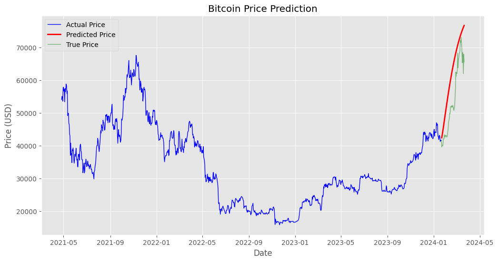

# Bitcoin Price Prediction with LSTM

## Project Overview
This project aims to predict Bitcoin (BTC) prices for the next 60 days using a Long Short-Term Memory (LSTM) neural network. The dataset used contains historical BTC/USD prices from 2014 to early 2024. The project leverages PyTorch for deep learning and includes data preprocessing, feature engineering, and model evaluation.

---

## Table of Contents
1. [Introduction](#introduction)
2. [Dataset Description](#dataset-description)
3. [Project Workflow](#project-workflow)
4. [Model Architecture](#model-architecture)
5. [Results](#results)
6. [How to Run](#how-to-run)
7. [Future Work](#future-work)
8. [References](#references)

---

## Introduction
Bitcoin is a highly volatile cryptocurrency, making price prediction a challenging task. This project uses sequential data modeling with LSTM to capture patterns in historical BTC prices and provide reliable predictions.

---

## Dataset Description
- **Source**: Kaggle
- **File**: `Dataset/BTC-USD.csv`
- **Columns**: `Date`, `Open`, `High`, `Low`, `Close`, `Adj Close`, `Volume`
- **Timeframe**: 2014 to early 2024
- **Frequency**: Minute-level data aggregated to daily prices.

---

## Project Workflow
### 1. Data Preparation
- Import libraries and load the dataset.
- Perform initial exploration to understand the data structure.

### 2. Data Cleaning
- Handle missing values and duplicates.
- Normalize and standardize the data for better model performance.

### 3. Exploratory Data Analysis (EDA)
- Visualize trends in BTC prices and trading volume.
- Analyze correlations between features.

### 4. Feature Engineering
- Create sequences of 30 days as input features.
- Scale features using `MinMaxScaler`.

### 5. Modeling
- Build LSTM and GRU models using PyTorch.
- Train the models with Mean Squared Error (MSE) loss and Adam optimizer.

### 6. Evaluation
- Evaluate the model using Root Mean Squared Error (RMSE).
- Visualize predictions against actual prices.

### 7. Prediction
- Predict BTC prices for the next 60 days.
- Compare predictions with actual future prices.

---

## Model Architecture
The LSTM model consists of:
- **Input Layer**: Sequence of 30 days of closing prices.
- **Hidden Layers**: 2 LSTM layers with 64 hidden units.
- **Output Layer**: Single neuron for predicting the next day's price.

---

## Results
- **LSTM Test RMSE**: ~1,118 USD
- **GRU Test RMSE**: ~21,445 USD
- The LSTM model outperformed the GRU model, demonstrating its ability to capture sequential patterns in BTC prices.



---

## How to Run
1. Clone the repository:
   ```bash
   git clone <repository-url>
   cd Bitcoin-Prediction
   ```

2. Install dependencies:
   ```bash
   pip install -r requirements.txt
   ```

3. Run the Jupyter Notebook:
   ```bash
   jupyter notebook Notebook.ipynb
   ```

4. Follow the steps in the notebook to train the model and visualize predictions.

---

## Future Work
- Add additional features such as macroeconomic indicators, Moving Average, RSI or sentiment analysis.
- Perform hyperparameter tuning to further improve model performance.
- Deploy the model as a web application for real-time predictions.

---

## References
- Kaggle Dataset: [BTC-USD Historical Data](https://www.kaggle.com/)
- PyTorch Documentation: [https://pytorch.org/](https://pytorch.org/)
- CoinGecko API: [https://www.coingecko.com/](https://www.coingecko.com/)